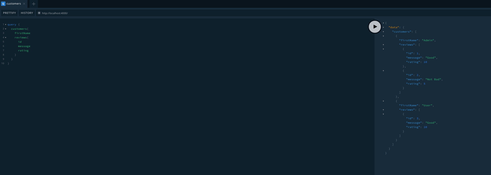

# Spring Boot GraphQL Federation Microservices Example

## Overview

Spring Boot GraphQL microservices demo that shows how to use DGS framework together with Apollo Federation Server.

All applications can be run locally, inside docker or kubernetes cluster. 

## Services

* [Apollo Gateway](./gateway) - Apollo Server acting as the Federated Gateway.
* [Customer Service](./customer-service) - Spring Boot GraphQL application providing the federated Customer type.
* [Review Service](./review-service) - Spring Boot GraphQL application that extends the Customer type with reviews.


## Architecture


## Build

You can build all the services by running the `buildDockerImages.sh` on Mac/Linux systems.

## Local Deployment

TODO: 

## Docker Deployment

Docker compose file with instructions are kept in [docker](./docker) subdirectory.

### Kubernetes Deployment

Kubernetes manifests with instructions are kept in [k8s](./k8s) subdirectory.

##  Usage
* Open [GraphQL playground GUI](http://localhost:4000/)

* Write the following query and tests the result: 
    -  Find all customers with reviews (federated query)
    ```
    query {
      customers{
        id
        firstName
        reviews{
          id
          rating
          message
        }
      }
    }
    ```
    e.g
    

    - Create new customer
    ```
    mutation {
      addCustomer(customer: { firstName: "New User" }) {
        id
        firstName
      }
    }
    ```

## References

* [GraphQL](https://graphql.org/)
* [Introduction to Apollo Server](https://www.apollographql.com/docs/apollo-server/)
* [Introduction to Apollo Federation](https://www.apollographql.com/docs/federation/)
* [DGS framework](https://netflix.github.io/dgs/)
