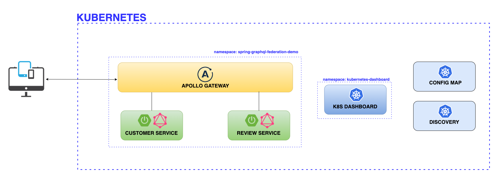

# Spring Boot GraphQL Federation Microservices (PoC)

Spring Boot GraphQL microservices demo that shows how to use DGS framework together with Apollo Federation Server.

All applications can be run locally, inside docker or kubernetes cluster.

## Table of Content

- [Services](#services)
- [Architecture](#architecture)
- [Getting Started](#getting-started)
  * [Installation](#installation)
  * [Usage](#usage)
- [Deployment](#deployment)
  * [Build](#build)
  * [Docker](#docker)
  * [Kubernetes](#kubernetes)
- [References](#references)
- [License](#license)


## Services

* [Apollo Gateway](./services/gateway) - Apollo Server acting as the Federated Gateway.
* [Customer Service](./services/customer-service) - Spring Boot GraphQL application providing the federated Customer type.
* [Review Service](./services/review-service) - Spring Boot GraphQL application that extends the Customer type with reviews.


## Architecture



## Getting Started

### Installation

Please refer to the individual readme files on instructions of how to run the services.

###  Usage
* Start services.

* Open [GraphQL playground GUI](http://localhost:4000/).

* Write the following query and tests the result:
  -  Find all customers with reviews (federated query)
    ```
    query {
      customers{
        id
        firstName
        reviews{
          id
          rating
          message
        }
      }
    }
    ```
  [e.g Federation Query Response](./_docs/img/federation-query.png)

  - Create new customer
    ```
    mutation {
      addCustomer(customer: { firstName: "New User" }) {
        id
        firstName
      }
    }
    ```

## Deployment

### Build

You can build all the services by running the `buildDockerImages.sh` on Mac/Linux systems.

### Docker

Docker compose file with instructions are kept in [docker](deployment/docker) subdirectory.

### Kubernetes

Kubernetes manifests with instructions are kept in [k8s](deployment/k8s) subdirectory.

## References

* [GraphQL](https://graphql.org/)
* [Introduction to Apollo Server](https://www.apollographql.com/docs/apollo-server/)
* [Introduction to Apollo Federation](https://www.apollographql.com/docs/federation/)
* [DGS framework](https://netflix.github.io/dgs/)

## License

Distributed under the MIT License. See `LICENSE` for more information.