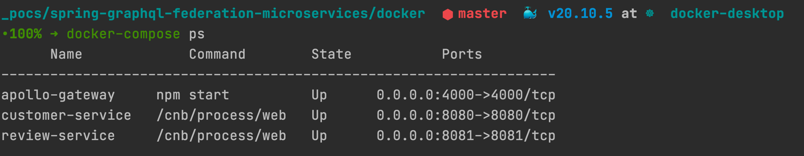

# Docker Deployment

## Overview

Docker compose files for running the demo.

## Getting Started



### Installation

```shell
# 1)Start microservices
docker-compose up -d customer-service review-service

# 1.1) Check services startup (Optional)
docker-compose logs -f customer-service
docker-compose logs -f review-service

# 2) Start Apollo Gateway 
docker-compose up -d apollo-gateway

# 2.1) Check Logs (Optional)
docker-compose logs -f apollo-gateway
```

### Uninstallation

```shell
docker-compose down -v
```

## Important Endpoints

| Name | Endpoint | 
| -------------:|:--------:|
| `Apollo Gateway` | http://localhost:4000/ |
| `Customer Service` | http://localhost:8080/ |
| `Review Service` | http://localhost:8081/ |
