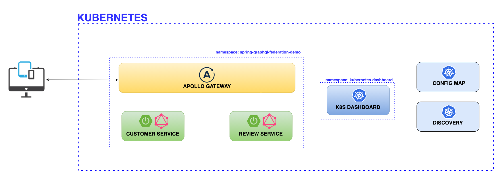

# Kubernetes Deployment

## Overview

Kubernetes manifest files for running the demo.

## Architecture



## Getting Started

### Installation

```shell
# Create spring-graphql-federation-demo namespace
kubectl create ns spring-graphql-federation-demo

# Deploy Customer Service
kubectl apply -f ./deployment/k8s/customer-service/customer-service.configmap.yml -n spring-graphql-federation-demo
kubectl apply -f ./deployment/k8s/customer-service/ -n spring-graphql-federation-demo


# Deploy Review Service
kubectl apply -f ./deployment/k8s/review-service/review-service.configmap.yml -n spring-graphql-federation-demo
kubectl apply -f ./deployment/k8s/review-service/ -n spring-graphql-federation-demo

# Deploy Apollo Gateway
kubectl apply -f ./deployment/k8s/apollo-gateway/ -n spring-graphql-federation-demo
```

### Port Forward commands
```shell
# Customer Service
kubectl port-forward -n spring-graphql-federation-demo svc/customer-service 8080:8080 

# Review Service
kubectl port-forward -n spring-graphql-federation-demo svc/review-service 8081:8080 

# Apollo Gateway
kubectl port-forward -n spring-graphql-federation-demo svc/apollo-gateway 4000:4000
```

### Additional tools

1. Kubernetes Dashboard - detailed instructions how to start can be found [here](./k8s-dashboard).


### Uninstallation

```shell
kubectl delete all --all -n spring-graphql-federation-demo
kubectl delete ns spring-graphql-federation-demo
```